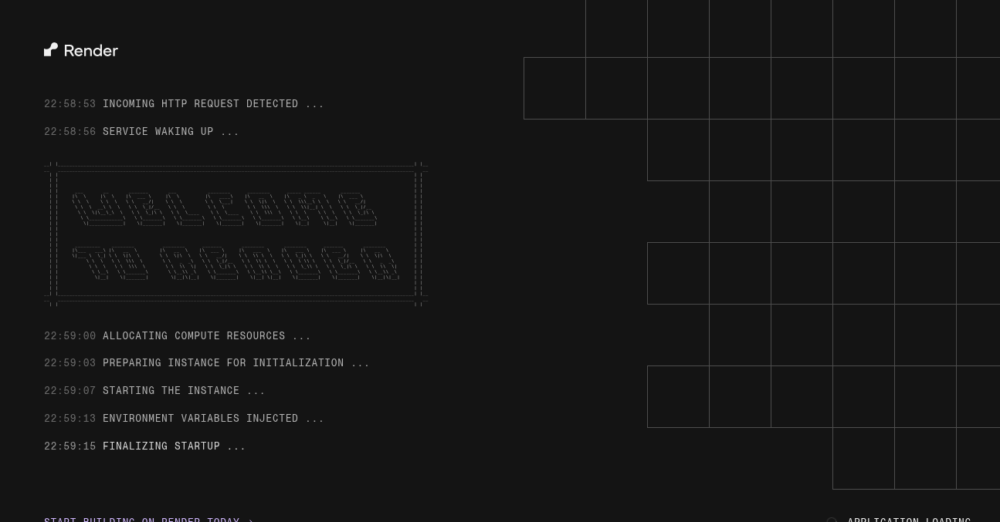
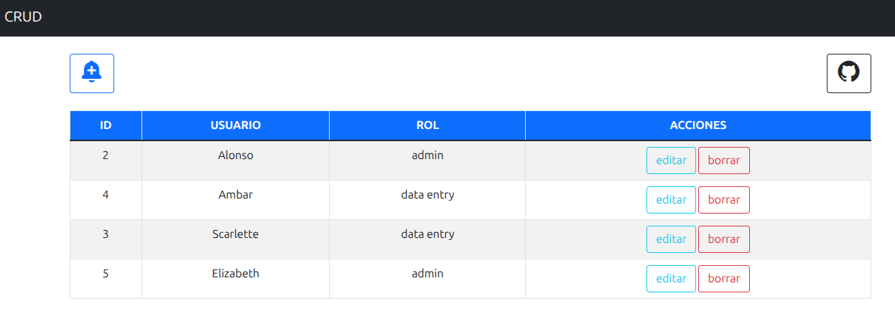
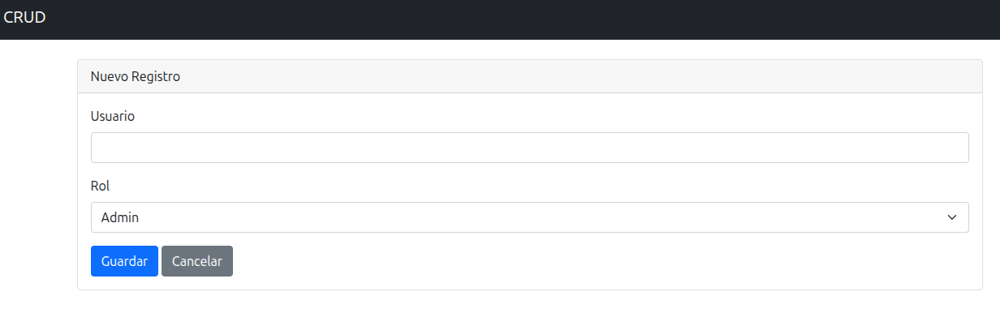
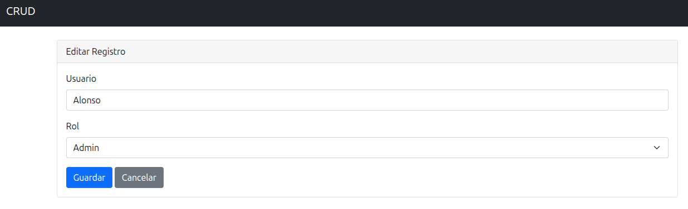

# 🚀 CRUD de Usuarios — Node.js + PostgreSQL

**Aplicación CRUD desarrollada con Node.js, Express y PostgreSQL para la gestión de usuarios y roles.**

**El proyecto permite crear, visualizar, editar y eliminar usuarios mediante una interfaz web simple, limpia y responsive.**

---

# 📸 Vista del Proyecto





---

# 🌐 Demo Online

- 🔗 https://crudchiquito.onrender.com

---

# ✨ Características

- ✅ Crear usuarios
- ✅ Listar usuarios
- ✅ Editar usuarios
- ✅ Eliminar usuarios
- ✅ Gestión de roles
- ✅ Interfaz responsive
- ✅ Integración con PostgreSQL
- ✅ Deploy en Render
- ✅ Base de datos en Supabase

---

# 🛠️ Tecnologías Utilizadas

## Backend

- Node.js
- Express.js
- PostgreSQL
- pg
- EJS

## Frontend

- Bootstrap 5
- Boxicons
- HTML5
- CSS3

## Deployment

- Render
- Supabase

---

# 📂 Estructura del Proyecto

```bash
crudchiquito/
│
├── controllers/
│   └── crud.js
│
├── database/
│   └── db.js
│
├── views/
│   ├── create.ejs
│   ├── edit.ejs
│   └── index.ejs
│
├── router.js
├── app.js
├── package.json
└── README.md
```
---

# ⚙️ Instalación
**1. Clonar repositorio**
```bash
git clone https://github.com/alonsocuevas/crudchiquito.git
```
 **2. Entrar al proyecto**
```bash
cd crudchiquito
```
**3. Instalar dependencias**
```bash
npm install
```
---
# 🔐 Variables de Entorno

Crear archivo .env
```bash
DATABASE_URL=tu_string_de_conexion_postgresql
```
---
# 🗄️ Base de Datos

Tabla utilizada:
```sql
CREATE TABLE users (
    id SERIAL PRIMARY KEY,
    username VARCHAR(100),
    rol VARCHAR(50)
);
```
---
# ▶️ Ejecutar Proyecto
**Desarrollo**
```bash
npx nodemon app.js
```
**Producción**
```bash
node app.js
```
---
# 🌍 Acceso Local
```bash
http://localhost:5000
```
---
# 📌 Endpoints
|Metodo|Ruta|Descripcion|
|-----|----|-----|
|GET|/|Listar usuarios|
|GET|/create|Formulario de accion|
|POST|/save|Guardar usuario|
|GET|/edit/:id|Formulario edicion|
|POST|/update|Actualizar usuario|
|GET|/delete/:id|Eliminar usuario|
---
# 🧠 Aprendizajes del Proyecto

**Este proyecto permitió practicar:**

- Arquitectura básica MVC
- Manejo de rutas con Express
- Integración con PostgreSQL
- Uso de variables de entorno
- Renderizado dinámico con EJS
- Deploy Full Stack
- Conexión remota a bases de datos
- CRUD completo funcional
---
# 🚧 Mejoras Futuras
- 🔍 Búsqueda de usuarios
- 📄 Paginación
- 🔐 Sistema de autenticación
- ✅ Validación de formularios
- ⚠️ Mensajes de error y éxito
- 🎨 Mejoras UI/UX
- 🌙 Dark Mode
- 📱 Mejor experiencia móvil
- 🧪 Testing
---
# 📦 Dependencias Principales
```json
{
  "express": "^4.x",
  "ejs": "^3.x",
  "pg": "^8.x",
  "dotenv": "^16.x",
  "nodemon": "^2.x"
}
```
---
# 👨‍💻 Autor
**Alonso Cuevas Pizarro**
- GitHub: https://github.com/alonsocuevas
---
# 📄 Licencia

Proyecto bajo licencia ISC.

---

# ⭐ Estado del Proyecto

✅ Funcional
✅ Deploy realizado
✅ CRUD completo operativo

---